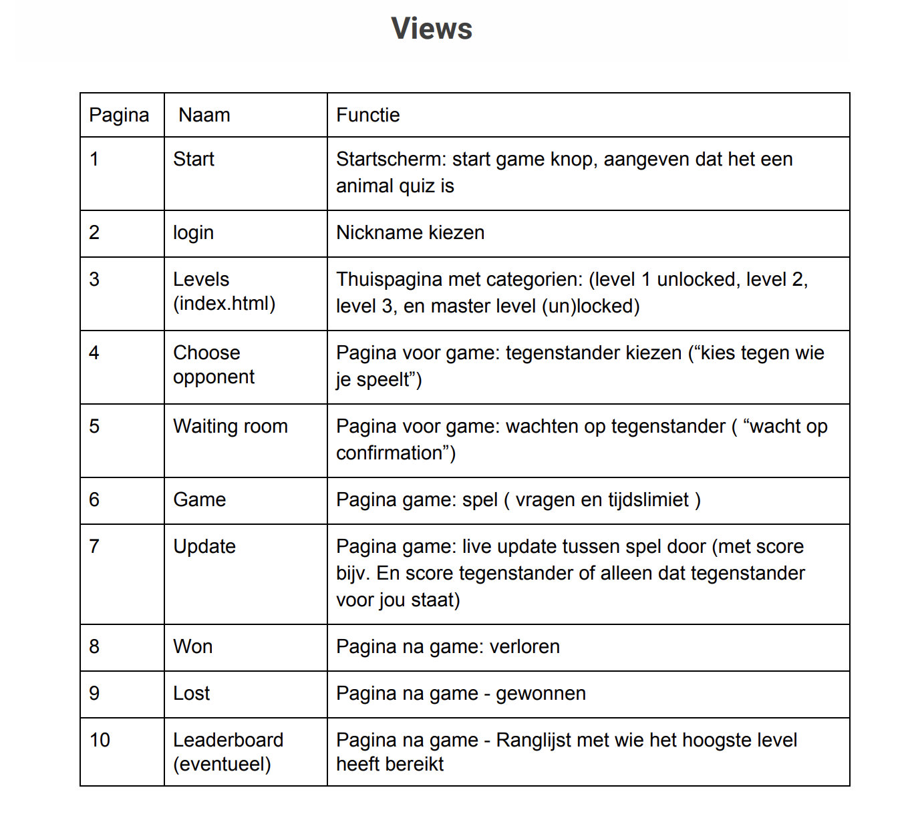
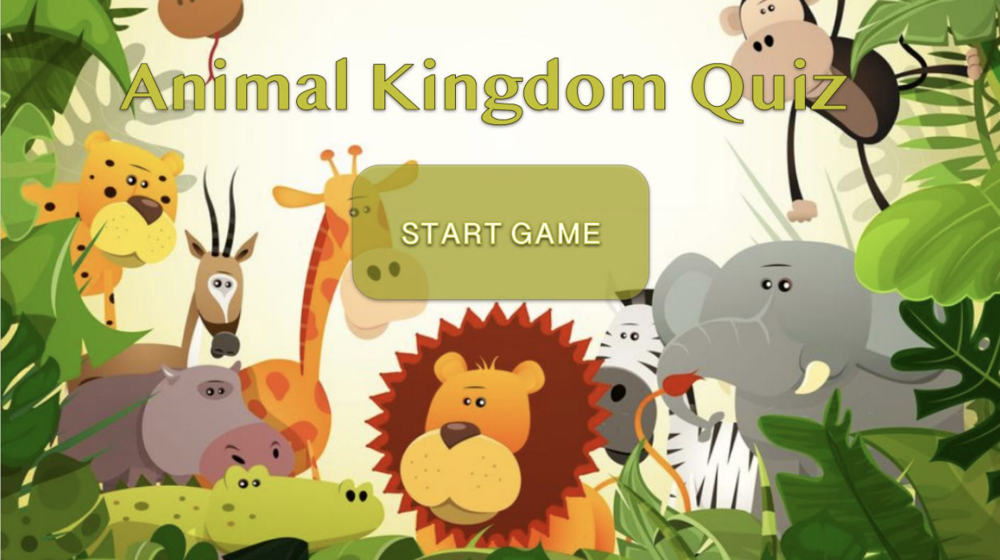
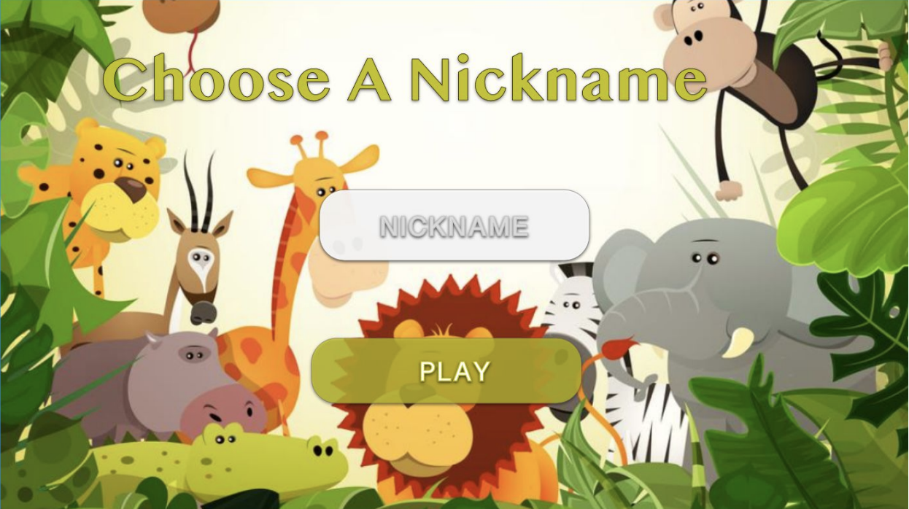
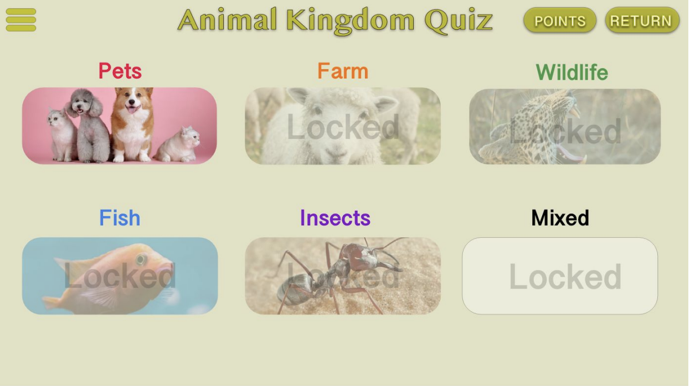
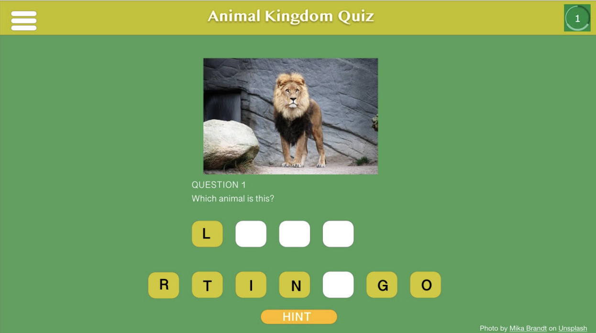
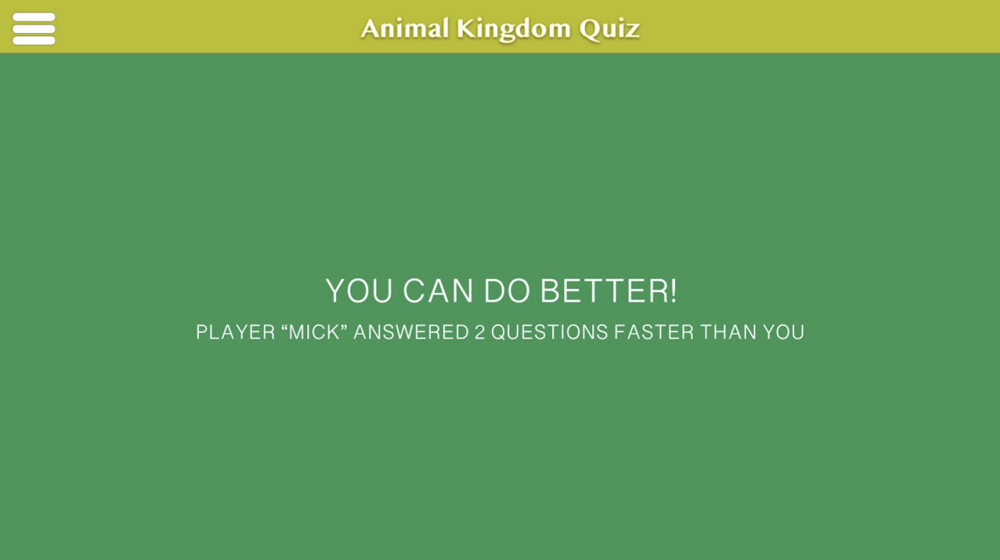
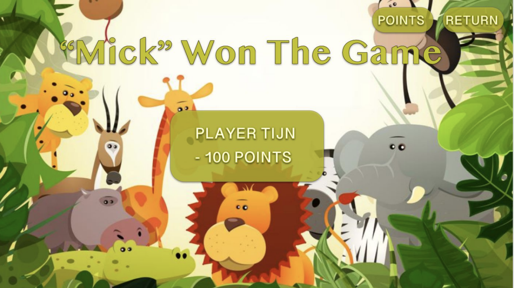
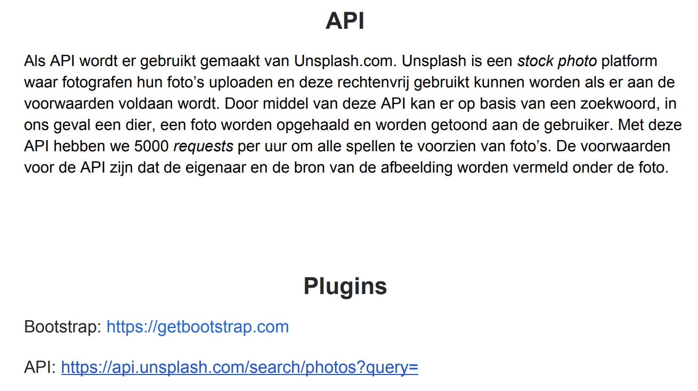

Controllers

““Starts game””
@app.route(“/start”)
Def start():

““Registration of user””
@app.route(“/register”, methods=["GET", "POST"])
def register():
 
““Let user see the game options””
@app.route(“/home”, methods=["GET", "POST"]) 
Registration required
def home():
 
““User will be forgotten after exiting game””
@app.route(“/delete”, methods=["GET", "POST"])
Registration required
def delete():
 

““User will be linked to existing game””
@app.route(“/opponent”, methods=["GET", "POST"])
registration required
def opponent():
 
““User will be able to add nickname to leaderboard””
@app.route(“/leaderboard”)
Registration required
def leaderboard():
 
““Redirects app route to correct level ””
@app.route(“/gameplay”)
registration required
def gameplay():
 
““Shows game result to user””
@app.route(“/result”, methods=["GET", "POST"])
registration required
def result():
 
 
““Updates user on progress””
@app.route(“/update”, methods=["GET", "POST"])
registration required
def update():
 
 
““  Decorate routes to require registration.”” (helpers)
@app.route(“/registration_required”)
def registration_required():
 
““ Return apology if user’s request is not valid. ”” (helpers)
@app.route(“/apology”)
Def apology():
 
““ Generate photo of given animal. ”” (helpers)
@app.route(“/generate_jpg”)
Def generate_jpg():

