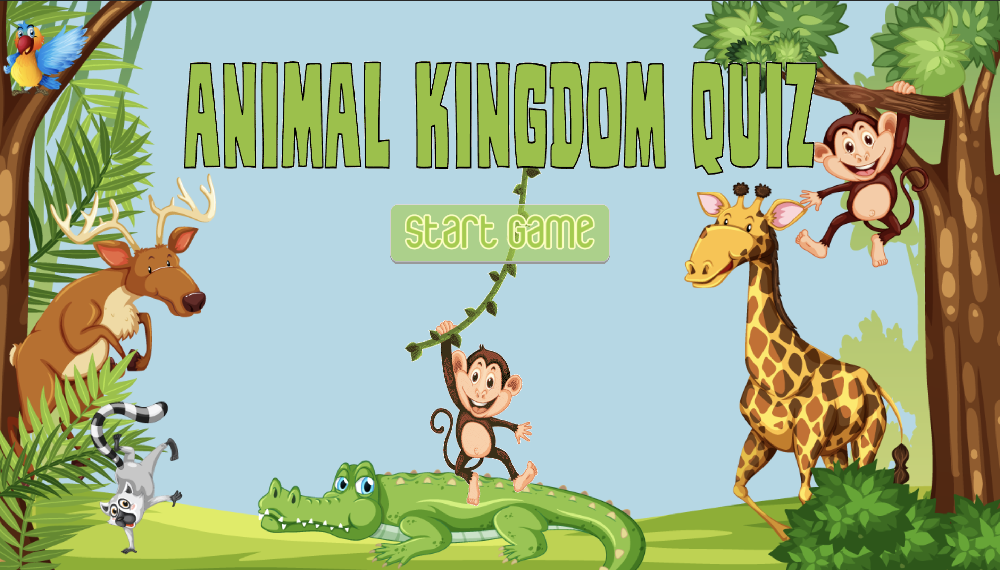
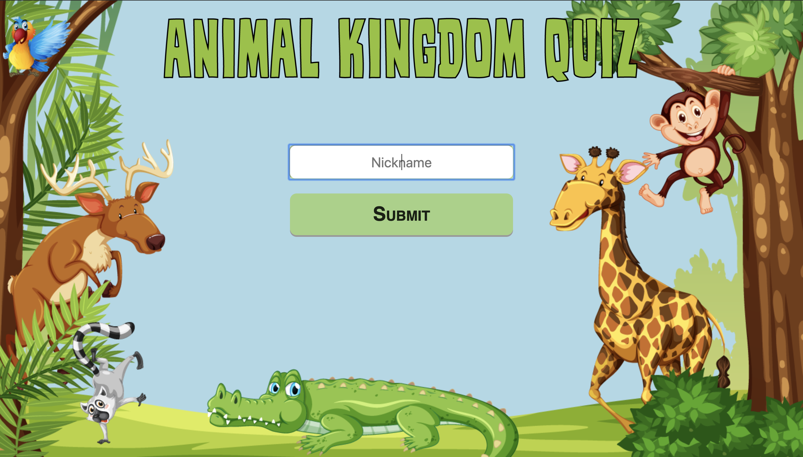
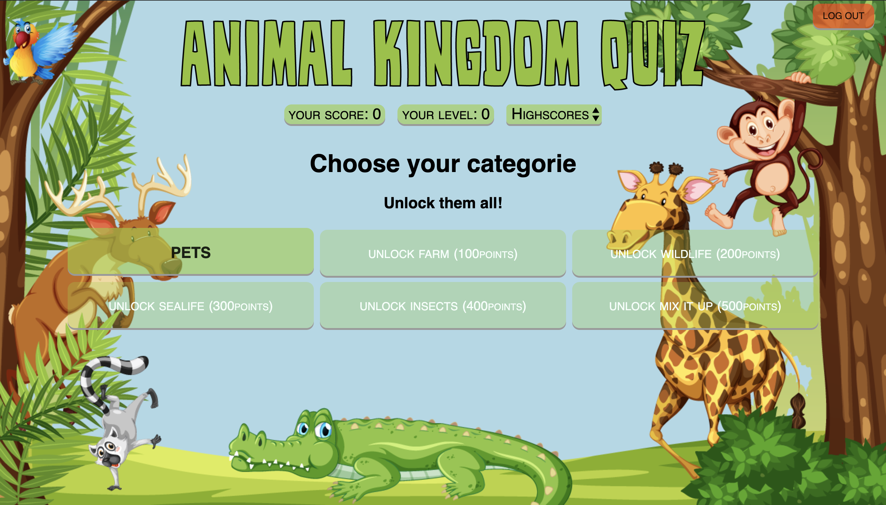
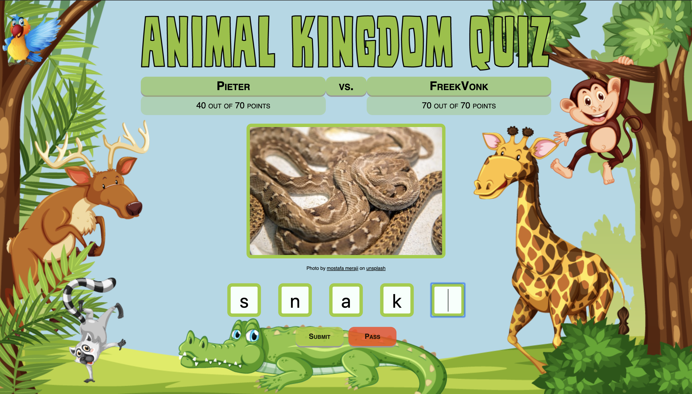
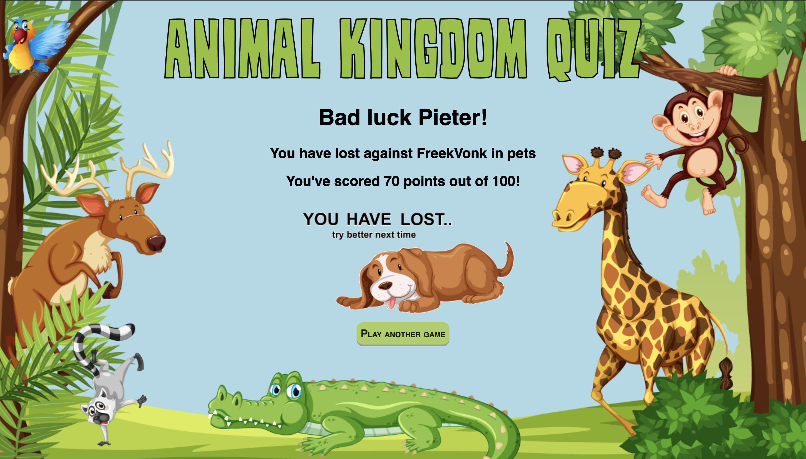
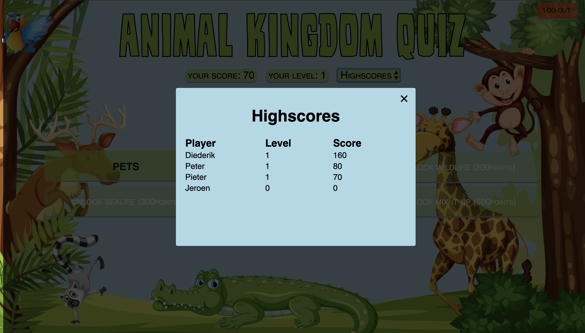

# Project WebIK:Animal Kingdom Quiz
Mick van den Boer,
Tijn Schickendantz,
Tijmen Kort &
Justine de Jong

## samenvatting
Onze applicatie *"Animal Kingdom Quiz"* is een trivia spel waarin de gebruiker spelenderwijs dierennamen leert. De gebruiker voert aan het begin van het spel zijn nickname in. Hieraan worden zijn punten verbonden. De gebruiker kan punten scoren door een quiz te maken. De gebruiker wordt uitgedaagd om bij elk quiz te winnen van zijn tegenstander. Als de gebruiker genoeg punten heeft en een quiz wint of gelijkspeeld dan wordt het volgende level ontgrendeld. De verschillende levels creëren de benodigde verdieping in dit spel. Daarnaast wordt een overzicht van gebruikers en hun behaalde score getoond op een leaderboard.  

## Projectverdeling

Binnen de groep is er veel samengewerkt. Iedereen heeft op dezelfde wijze bijgedragen aan het project. Er is bijvoorbeeld  niet iemand geweest die heeft gefocust op de lay-out of iemand meer op de database. Wij hebben elke dag een lijstje gemaakt met taken en eerlijk verdeeld over de groep. Natuurlijk was er ruimte voor eigen iniatief en die is zeker getoond. 

## Screenshots

## Features

* Registratiepagina 
  * De gebruiker kiest een nickname van minimaal 1 letter en maximaal 15 letters.
  
  * deze nickname is voor eenmalig gebruik van het spel. Als de gebruiker uitlogt is deze nickname niet meer beschikbaar. De nickname en de bijbehorende score blijven wel zichtbaar op het leaderboard. 
  
  
* multiplayer illusion
  * Een gebruiker wordt in een "neppe" wachtruime geplaatst om de illusie te wekken dat de gebruiker moet wachten op een tegenstander. 
  
  * Een gebruiker wordt per ronde gekoppelt aan een tegenstander. Deze tegenstander bestaat echt maar is niet live. 
  
 
* Score systeem
  * gebruikers kunnen punten scoren bij een goed beantwoorde vraag
  
  * 10 vragen per quiz.
  
  * 10 punten per juist beantwoorde vraag.
  
  * In totaal kan een gebruiker dus 100 punten behalen per quiz.

  * Een gebruiker kan een quiz winnen, gelijkspelen of verliezen. 
  
  * Gebruikers kunnen levels ontgrendelen met bepaalde punten.
  

* levels 
  * *Level 1*: kan altijd gespeeld worden.

  * *Level 2*: unlocked vanaf 100 punten en level 1 gewonnen of gelijkgespeeld.

  * *Level 3*: unlocked vanaf 200 punten en level 2 gewonnen of gelijkgespeeld.

  * *Level 4*: unlocked vanaf 300 punten en level 3 gewonnen of gelijkgespeeld.

  * *Level 5*: unlocked vanaf 400 punten en level 4 gewonnen of gelijkgespeeld.

  * *Mix:* unlocked vanaf 500 punten en level 5 gewonnen of gelijkgespeeld.

* log out 
  * Op de indexpagina kan de gebruiker uitloggen door de log out button. Hiermee word de gebruiker geredirect naar de startpagina
 

* extra's
  * Een leaderboard die de huidige ranglijst met spelers en hun bijbehorende scores geeft.
  
  * Als de gebruiker gewonnen heeft komt hij terecht op de winner's pagina. Hierin staat een leuke afbeelding die verbonden is met de huidige categorie.
  
  * Op het beginscherm hebben we een aapje gemaakt die over het scherm slingert.

## Wegwijs door de repository

**bestanden**

* *application.py* 

* *helpers.py*: bestand met onze helperfuncties (API_request en Gama_data)

* *dataquery.py*: bestand met alle database queries

* *webprogrammeren.db*: onze database met 3 tabellen (users, animals & games)

**folders**

* *docs*
  * READ.ME + plaatjes voor in de READ.ME
  * TechDesign ( technisch ontwerp) + plaatjes technisch ontwerp
 

* *static*
  * Images: map met plaatjes voor op de site
 
  * page_style: css bestanden per pagina
 
  * winnerpage: gifjes voor op de winner pagina
 
  * styles.css: css hoofdbestand, overkoeplende opmaak
 
  * script.js: bestand met onze java functies
 

* *templates*
  *  Onze html templates
 

## API
Als API wordt er gebruikt gemaakt van Unsplash.com. Unsplash is een stock photo platform waar fotografen hun foto’s uploaden en deze rechtenvrij gebruikt kunnen worden als er aan de voorwaarden voldaan wordt. Door middel van deze API kan er op basis van een zoekwoord, in ons geval een dier, een foto worden opgehaald en worden getoond aan de gebruiker. Met deze API hebben we 5000 requests per uur om alle spellen te voorzien van foto’s. De voorwaarden voor de API zijn dat de eigenaar en de bron van de afbeelding worden vermeld onder de foto. 

De link die wij gebruiken voor unsplash is: 'https://api.unsplash.com/search/photos?query='animal'&page=1&per_page=1&orientation=landscape&client_id=5246d76723858160b0f3fc3d254a89d4a27144e528dda80235c28c6874cdc014'

