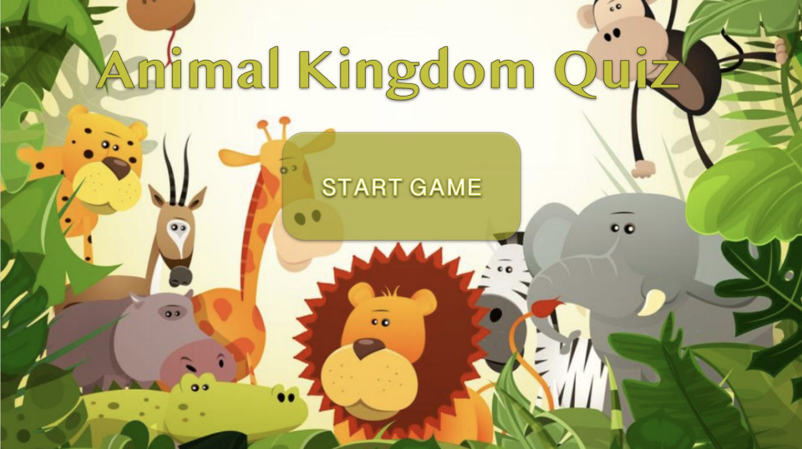
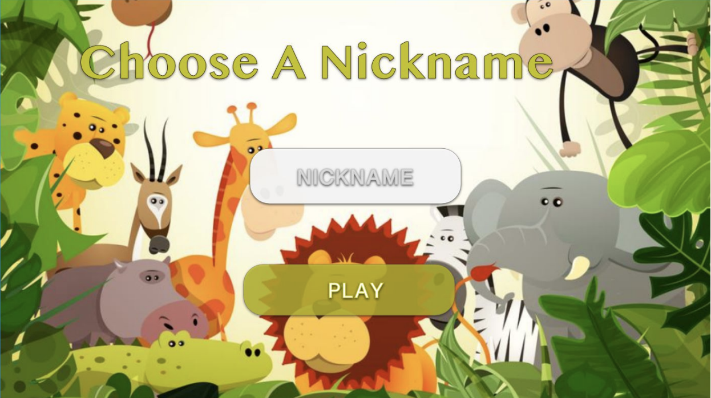
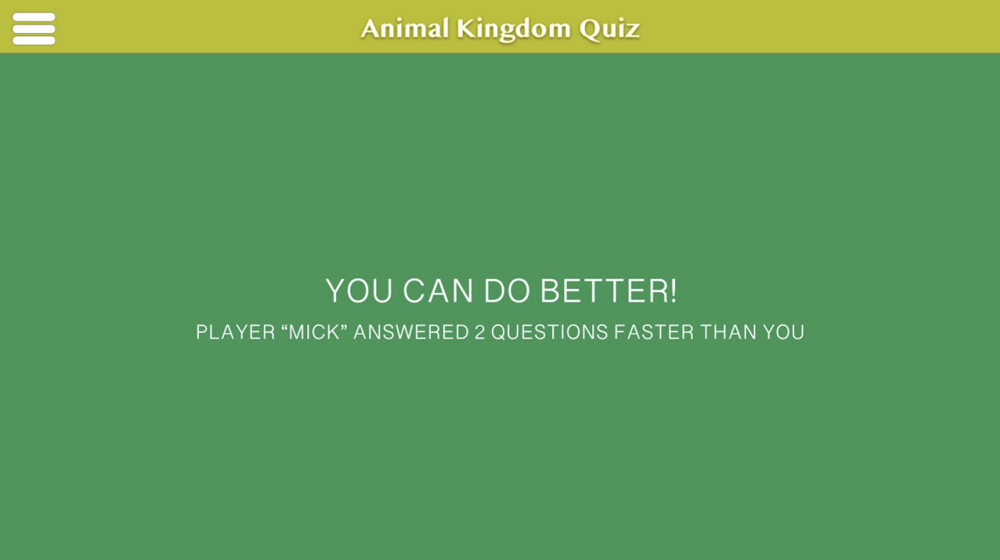
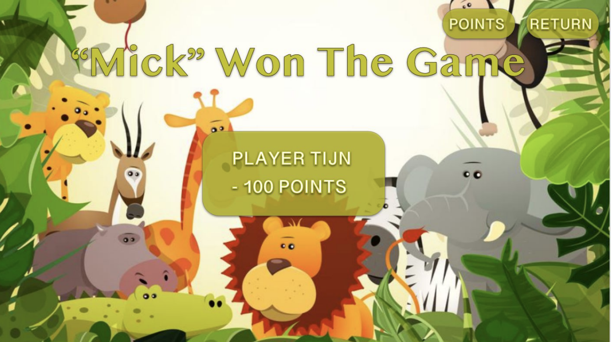

# Project Animal Kingdom Quiz
Mick van den Boer,
Tijn Schickendantz,
Tijmen Kort &
Justine de Jong

## samenvatting
Onze applicatie *"Animal Kingdom Quiz"* is een trivia spel waarin de gebruiker spelenderwijs dierennamen leert. 
De verschillende levels creëren de benodigde verdieping en uitdaging in dit spel. Binnen het spel wordt de gebruiker gekoppeld aan een tegenstander. Als de gebruiker genoeg punten heeft en een ronde wint dan wordt de volgende categorie ontgrendeld. 

## Schetsen

## Features
gebruikers kunnen punten scoren bij een goed beantwoorde vraag
gebruikers kunnen punten scoren bij het winnen van een game
gebruikers kunnen een levels ontgrendelen 
gebruikers worden per ronde gekoppelt aan een tegenstander 

## Score systeem 
### Hoofdlijnen
*10 vragen per quiz
*10 punten per juist beantwoorde vraag
*Winnaar krijgt 30 bonus punten.
*Gelijkspel geen bonuspunten.
  
### levels
*Level 1: kan altijd gespeeld worden.
*Level 2: unlocked vanaf 100 punten.
*Level 3: unlocked vanaf 200 punten.
*Level 4: unlocked vanaf 300 punten.
*Level 5: unlocked vanaf 400 punten.
*Mix: unlocked vanaf 500 punten.

## API
Als API wordt er gebruikt gemaakt van Unsplash.com. Unsplash is een stock photo platform waar fotografen hun foto’s uploaden en deze rechtenvrij gebruikt kunnen worden als er aan de voorwaarden voldaan wordt. Door middel van deze API kan er op basis van een zoekwoord, in ons geval een dier, een foto worden opgehaald en worden getoond aan de gebruiker. Met deze API hebben we 5000 requests per uur om alle spellen te voorzien van foto’s. De voorwaarden voor de API zijn dat de eigenaar en de bron van de afbeelding worden vermeld onder de foto. 

