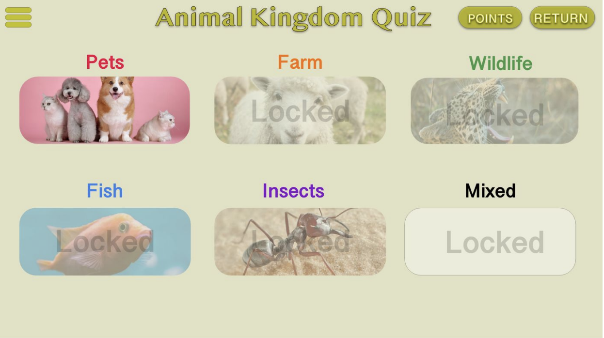

# Project WebIK:Animal Kingdom Quiz
Mick van den Boer,
Tijn Schickendantz,
Tijmen Kort &
Justine de Jong

## samenvatting
Onze applicatie *"Animal Kingdom Quiz"* is een trivia spel waarin de gebruiker spelenderwijs dierennamen leert. De gebruiker voert aan het begin van het spel zijn nickname in. Hieraan worden zijn punten verbonden. De gebruiker kan punten scoren door spelletjes te spelen. De gebruiker wordt uitgedaagd om bij elk spelletje te winnen van zijn tegenstander. Als de gebruiker genoeg punten heeft en een spelletje wint of gelijkspeeld dan wordt het volgende level ontgrendeld. De verschillende levels creëren de benodigde verdieping in dit spel. Daarnaast wordt een overzicht van gebruikers en hun behaalde score getoond op een leaderboard.  

## Projectverdeling

# Mick:

# Tijn:

# Tijmen:

# Justine:

## Screenshots

## Wegwijs door de repository

## Features
gebruikers kunnen punten scoren bij een goed beantwoorde vraag

gebruikers kunnen punten scoren bij het winnen van een game

gebruikers kunnen een levels ontgrendelen 

gebruikers worden per ronde gekoppelt aan een tegenstander 

## Score systeem 

### Hoofdlijnen
10 vragen per quiz

10 punten per juist beantwoorde vraag

Le
  
  
### levels
Level 1: kan altijd gespeeld worden.

Level 2: unlocked vanaf 100 punten en level 1 gewonnen of gelijkgespeeld.

Level 3: unlocked vanaf 200 punten en level 2 gewonnen of gelijkgespeeld.

Level 4: unlocked vanaf 300 punten en level 3 gewonnen of gelijkgespeeld.

Level 5: unlocked vanaf 400 punten en level 4 gewonnen of gelijkgespeeld.

Mix: unlocked vanaf 500 punten en level 5 gewonnen of gelijkgespeeld.

## API
Als API wordt er gebruikt gemaakt van Unsplash.com. Unsplash is een stock photo platform waar fotografen hun foto’s uploaden en deze rechtenvrij gebruikt kunnen worden als er aan de voorwaarden voldaan wordt. Door middel van deze API kan er op basis van een zoekwoord, in ons geval een dier, een foto worden opgehaald en worden getoond aan de gebruiker. Met deze API hebben we 5000 requests per uur om alle spellen te voorzien van foto’s. De voorwaarden voor de API zijn dat de eigenaar en de bron van de afbeelding worden vermeld onder de foto. 

